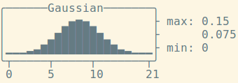

# SimplePlot

**SimplePlot** is a microtool to plot simple data curves as text, like this:

**SimplePlot** reads values from STDIN. Each value becomes a data point. The appearance can be changed using various options:

    --max         Upper plot y-limit
    --min         Lower plot y-limit
    --height      Plot height in lines
    --width       Plot width in characters
    --title       Plot title
    --no-box      Disable enclosing box
    --no-color    Disable color output

**SimplePlot** and its components are under MIT license.

